## Guardian360 App

Team Members

- [Tirthraj Mahajan](https://www.linkedin.com/in/tirthraj-mahajan/)
- [Amey Kulkarni](https://www.linkedin.com/in/amey-amit-kulkarni/)
- [Advait Joshi](https://www.linkedin.com/in/joshiadvait/)
- [Anshul Kalbande](https://www.linkedin.com/in/anshul-kalbande-a44b36219/)
- [Anurag Mandke](https://www.linkedin.com/in/anuragmandke/)

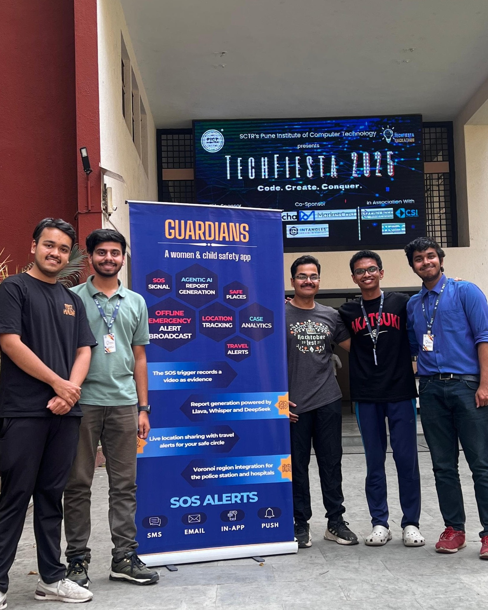

---

## About

**Guardian360** is an emergency alert system developed for **[Techfiesta 2025](https://techfiesta.pict.edu/)**, a 24-hour hackathon organized by the **[Pune Institute of Computer Technology](https://www.pict.edu/)**. The project was undertaken as part of the **Women and Child Safety domain**, addressing the problem statement titled **Emergency Alert System**.

> **Problem Statement:**
> Create a system that would allow users to send a distress signal to predefined contacts, complete with their real-time location and a brief message. The solution needed to include a mobile app interface for sending alerts and a robust backend server to process and relay these alerts efficiently. It was a problem that demanded both technical precision and a deep understanding of the urgency and sensitivity of the situation.

The team behind Guardian360 comprises a group of passionate engineers with prior experience in hackathons and software development. In the previous year, the team participated in Techfiesta 2024, where they secured the 1st Runner-up position in the Healthcare category for their project, Local Shrinks. The experience gained from this prior endeavor played a significant role in shaping the team's approach to Guardian360. For more details on their previous work, refer to the project repository: [Local Shrinks](https://github.com/tirthraj07/Local-Shrinks).

Guardian360 was more than just a project for us; it was a mission to create something that could potentially save lives. Every line of code, every design decision, and every late-night debugging session was fueled by the belief that technology, when used thoughtfully, could make the world a safer place. And as the clock ticked down during those 24 hours, we poured our hearts into building a system that we hoped would one day make a real difference.

## Achievements

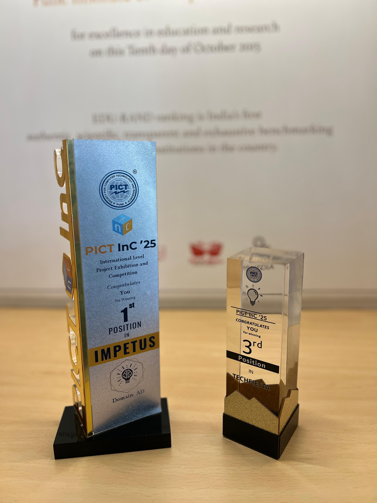

**Guardian360** has secured **3rd Place** out of 350+ teams at [Techfiesta 2025](https://techfiesta.pict.edu/) organised by **[Pune Institute of Computer Technology](https://www.pict.edu/)** 

Also, it stood **1st** at PICT's flagship technical event, **[Impetus and Concepts (InC) 2025](https://pictinc.org/)** in the **Application Development Domain**.

> **Impetus** is an **intercollegiate international level competition** and has been attracting corporate giants for not only sponsorship but also in terms of time and guidance to the participants. Industries such as eQ Technologic, Microsoft, Mobiliya, Deutsche Bank Group, Avaya, Siemens, Sagitech, Apporbit, e-Zest, HP, Indian Oil, 3 Ogeestudio, Tata, Mojo Networks, Ryussi, Tibco, Calsoft, Persistent, Pubmatic, IBM, Airtight, AthenaHealth, IEEE, ACM, CSI, were closely associated with this event. During the 3 day event, first year, second year and third year students from various colleges across India and abroad showcase their projects in domains like Application Development, Communication Networks, Pattern Recognition and AI, Digital Image Processing, Security and more!

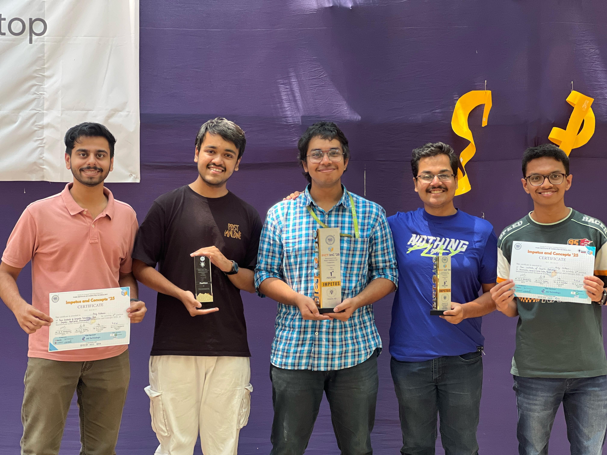

---

## Project Idea - Guardian360

After extensive brainstorming and deliberation, the team identified three critical phases to address in the context of emergency situations:

- **Precaution**
- **Panic**
- **Post-Incident**

Each phase was designed to cater to specific user needs, ensuring a comprehensive safety solution.

---

### Precaution Phase

The team firmly believes that "precaution is better than cure." This phase focuses on proactive measures to alert users about potential risks and ensure their safety before an incident occurs.

#### 1. Real-Time Location Sharing

Upon signing up, users can add trusted individuals to their **"Close Circle"**. Once configured, users can view the real-time location of their Close Circle members at all times. This feature operates seamlessly in both foreground and background modes.

To ensure accuracy and reliability, the team implemented a mechanism to bypass Android's restrictions, enabling location updates every **5-10 seconds**, even **when the device is switched off**. This is a significant improvement over existing applications, where location updates often experience delays of 30 seconds or more.

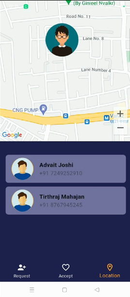

#### 2. Poking/Heartbeat Mechanism

The Poking Mechanism is designed to verify the reachability of a user. By sending an `"Are you alive?"` signal to the recipient's device, the app automatically detects and responds to the request. This feature, also known as the **Heartbeat Mechanism**, ensures that users can quickly confirm the availability of their Close Circle members.

#### 3. Travel Alerts

For users traveling in taxis, buses, or other forms of transport where they may feel unsafe, the **Travel Mode** feature can be activated. This mode notifies the Close Circle about the cab number and sends frequent reminders to check on the user's location. Additionally, users can customize the frequency of these notifications based on their level of concern, ensuring timely updates during high-risk situations.

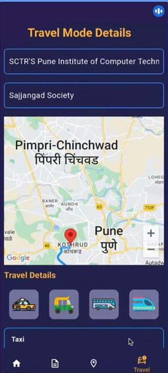

Example of Travel Mode SMS
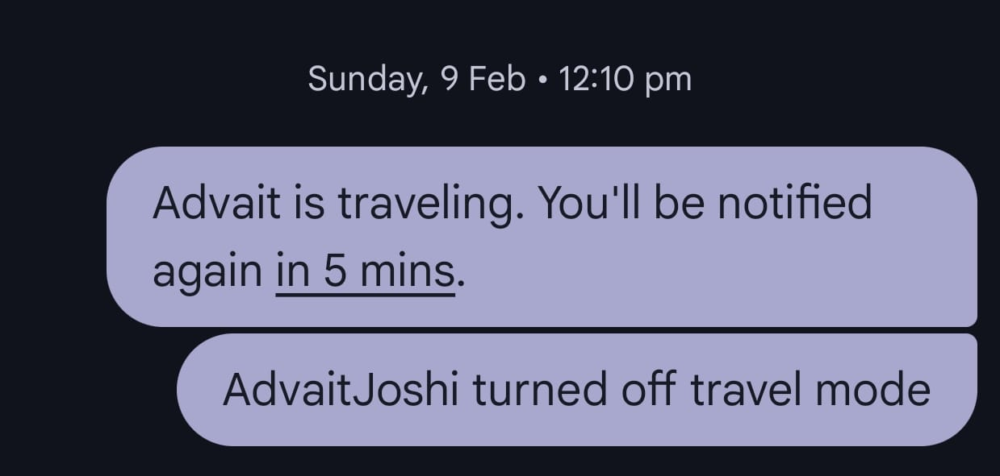

#### 4. Adaptive Location Alerts

To enhance situational awareness, the team implemented **Adaptive Location Alerts**. The city is divided into regions corresponding to police stations using a **Voronoi Diagram**. By leveraging geofencing, the app detects when a user enters a new region.

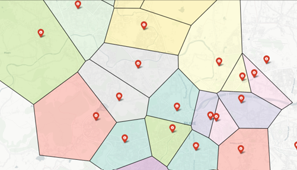

Upon entering a new region, the system evaluates aggregated incident reports based on their severity. If the severity score exceeds a predefined threshold, an Adaptive Location Alert is sent to the user. This alert provides details about recent incidents in the area, enabling users to exercise caution and make informed decisions about their safety.

This feature ensures that users are always aware of potential risks in their vicinity, empowering them to take proactive measures to stay safe.

Email Example of Adaptive Alert:   

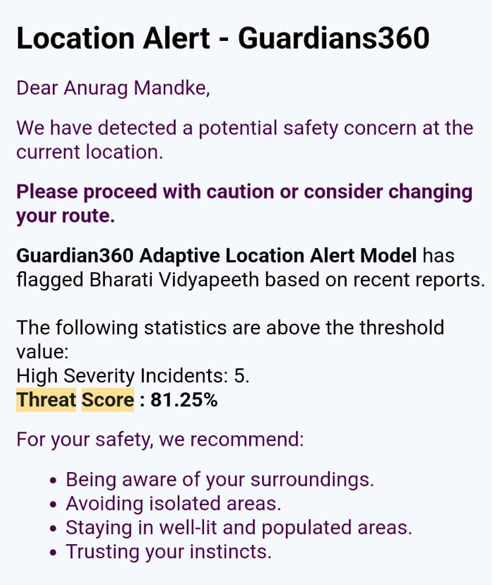

##### 5. Battery and Network Alerts

To further enhance user safety, Guardian360 monitors battery levels and network connectivity. If a user's **battery drops** below a critical threshold, a low battery alert is sent to their Close Circle, prompting them to check on the user's well-being. 
Additionally, if a user remains **disconnected from the internet for an extended period**, an automatic SMS notification is sent to their Close Circle, informing them about the potential network issue. This ensures that Close Circle members are aware of possible communication disruptions and can take necessary actions if needed.

---

### Panic Phase

The Panic Phase is designed for real-time emergency situations where immediate assistance is required. 

#### 1. SOS Alert (Online and Offline)

When a user triggers an SOS alert, Guardian360 sends real-time emergency notifications to their Close Circle and emergency contacts. The alert contains the user's real-time location.

**Online Mode**: If the user has an active internet connection, the SOS alert is sent instantly with continuous location updates.

**Offline Mode**: If no internet is available, the system falls back to SMS-based alerts, ensuring that at least the last known location is transmitted to emergency contacts.

The SOS signal is **first transmitted through SMS**, sent to the Close Circle, nearby police authorities, and the **server's SMS gateway**. 

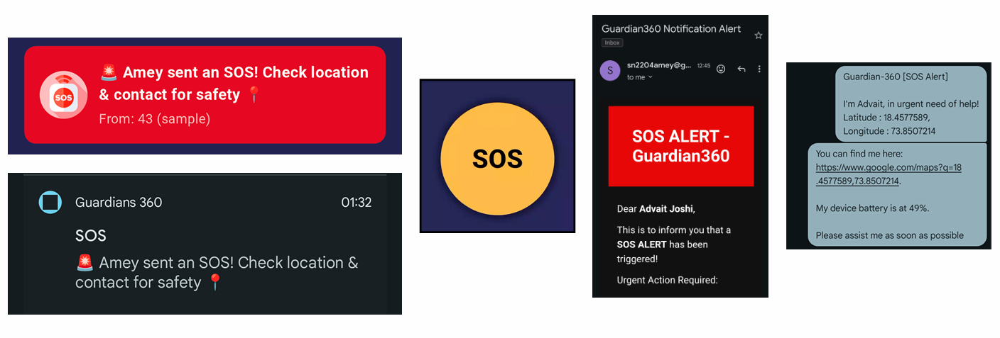

If **online**, an additional SOS alert is triggered via an HTTP request to the server. Once the server receives **at least one SOS signal**, it relays the alert to the Close Circle, authorities, and nearby users. A retry mechanism is in place to ensure that at least one of these recipients receives the alert.

Guardian360 follows a **flooding mechanism** to ensure that at least one person receives the notification. If any single recipient receives the SOS alert, the system automatically attempts to deliver it to all intended recipients, **ensuring that no distress signal is lost**. If the alert is received only by the police station via SMS, the system will then try to **re-broadcast** it to the Close Circle and nearby users, maximizing the chances of delivering **at least one** successful notification.

_Fooding Example_
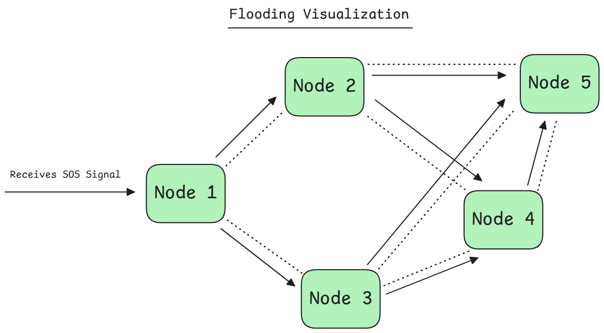

 

Additionally, when the SOS is triggered, a **video is recorded in the background to capture potential evidence**.

**Offline Mode**: The video is saved in local storage.

**Online Mode**: The video is **transmitted in 30-second segments** to the server **to account for possible bandwidth limitations** in different areas. The server then joins these video chunks and processes them using AI-based analysis.

##### AI Service
Our AI Service asynchronously generates a report using several agents:

1. The video is divided into n chunks based on its length.

2. The audio of each chunk is transcribed using the OpenAI Whisper model (Speech-to-Text agent).
 
3. Frames are extracted from each chunk at fixed intervals.

4. These frames are analyzed using the LLaVa model (Image-to-Text agent) for image descriptions.

5. Both the transcript and image descriptions are passed to the DeepSeek agent to generate a detailed report for each chunk.

Steps 2–5 are repeated for each chunk, with context retained between chunks.

A final combined report is generated and stored in the database for use in Post-Incident and Adaptive Alert phases.

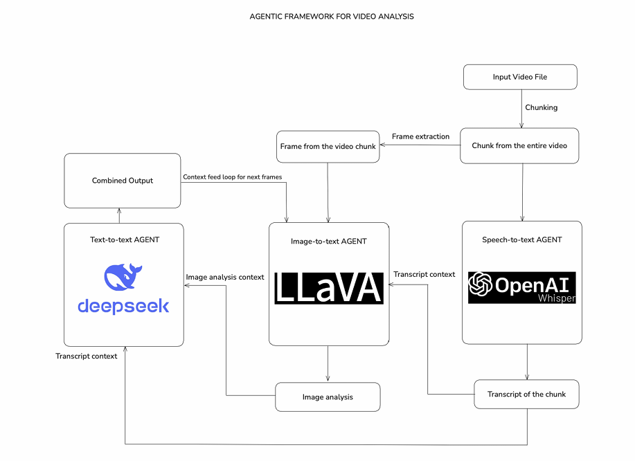

#### 2. SOS Button

As this product was also develpped for children, a physical **SOS Button** is provided for emergency use. This button can be integrated with wearable form factor, allowing it to be more accessible than an on screen button. On pressing the button, it sends the SOS signal similar to the signal sent through the application.

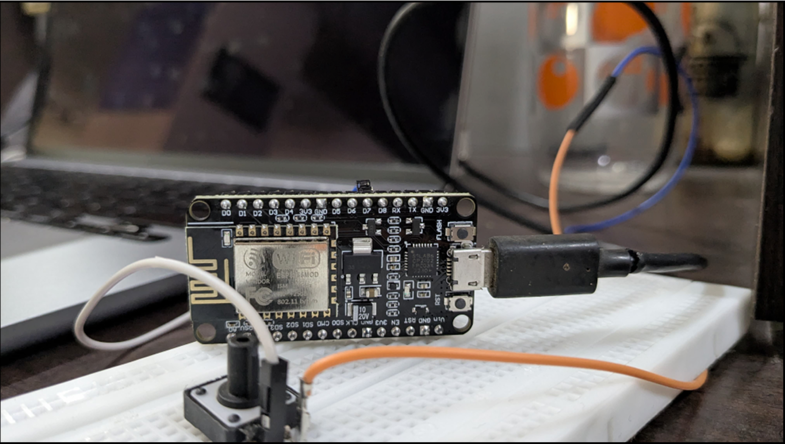

#### 3. Emergency Broadcast

To ensure immediate assistance, Guardian360 implements an **Amber Alert-type SOS broadcast**. When an SOS is triggered, nearby users within a predefined radius also receive an emergency alert. This allows strangers in close proximity to respond and provide immediate help rather than waiting for police or close friends to arrive. This crowdsourced emergency response increases the chances of **rapid intervention and enhances overall safety**.

---

### Post-Incident Phase

Even after an emergency, Guardian360 continues to assist users in documenting incidents and facilitating legal action if necessary.

#### 1. Incident Report

Users can submit detailed reports about incidents they have experienced or witnessed. These reports include:
- A structured incident description
- Supporting media (images, audio, video)
- Anonymity options for whistleblowers
- AI-based categorization for quick processing

Law enforcement agencies can use this data to analyze crime trends and deploy resources effectively.

An **aggregator** (cron job) is used to aggregate all the reports in a region (both SOS reports and post-incident reports). It determines a severity score for each report and the aggregation. If the aggregated result crosses a certain threshold, people in the region or traveling through the region are notified.

#### 2. Post-Incident Event Logging

Every emergency incident is logged, allowing users to track the progress of their case. The logs include timestamps for:
- User location logs
- SOS alert activation
- Emergency contact response time

Users can access these logs to follow up on their reports and ensure accountability from relevant authorities.

#### 3. Police Station Analysis (Police Station Web App)

Guardian360 is not just an application for prevention and reporting—it is a holistic safety ecosystem aimed at assisting government agencies and law enforcement in mitigating security threats and fostering a safer environment. By providing data-driven insights, predictive analytics, and real-time reports, we empower authorities to proactively address safety concerns, allocate resources efficiently, and take preventive measures to reduce crime rates.

A **dedicated web application for police stations** provides access to aggregated incident reports and analytics. Features include:
- **Live SOS alerts** for quicker response
- **Crime pattern analysis** to improve preventive measures
- **Incident resolution tracking** to ensure timely intervention

By integrating law enforcement agencies into the Guardian360 ecosystem, the platform enhances public safety and strengthens emergency response systems.

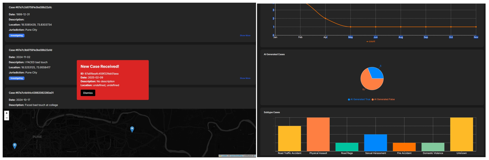
---

By addressing these three phases—Precaution, Panic, and Post-Incident—the team aimed to create a holistic safety solution that prioritizes user well-being and leverages technology to mitigate risks effectively.

---

## Project Implementation

### System Design

